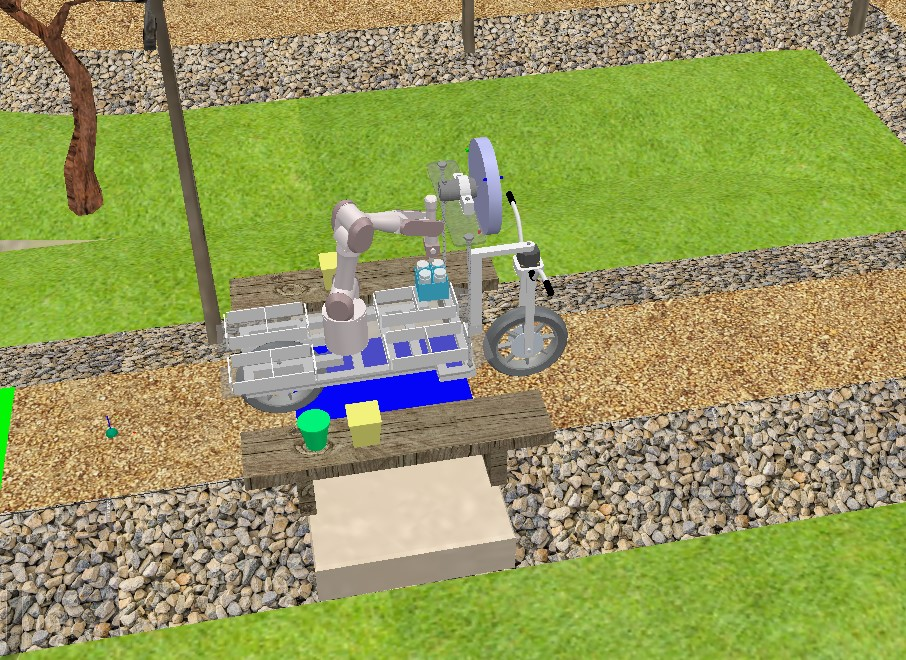

# DairyBike Project - eYRC 2021

The **DairyBike** project is a simulation-based implementation of a self-balancing delivery bike, designed to autonomously pick up and deliver dairy products in a virtual cityscape.

## 🚲 Project Overview

This project focuses on developing a **two-wheeled self-balancing robot** equipped with a **robotic arm** to perform pickups and deliveries. The bike navigates autonomously through the arena, handling delivery orders based on package priority—posing a challenging **path planning** and **control systems** problem.

### 🧠 Key Features

- **Self-Balancing Mechanism** using a **reaction wheel** controlled by a **Linear Quadratic Regulator (LQR)**.
- **Dynamics derived using** the **Euler-Lagrange Method**.
- **Autonomous Navigation** with delivery prioritization.
- **Pickup & Delivery System** controlled through **inverse kinematics**.
- Fully simulated in a 3D environment using **CoppeliaSim**.

## 🔧 Tools & Technologies

- **Simulation:** CoppeliaSim
- **Programming:** Lua (simulation logic), Octave (control and dynamics)
- **Design & Modeling:** Fusion 360
- **Control Theory:**  
  - Self-Balancing Robot  
  - State-Space Modeling  
  - Euler-Lagrange Mechanics  
  - Linear Quadratic Regulator (LQR)  
  - Inverse Kinematics

## 📦 Main Challenges

- Balancing a two-wheeled bike using feedback control
- Navigating autonomously while optimizing delivery path
- Executing precise pickup and drop-off tasks with a robotic arm

## 🎥 Final Demo
  
👉 **[Final Demo Video](https://youtu.be/Zx62de5Fl7A)**

